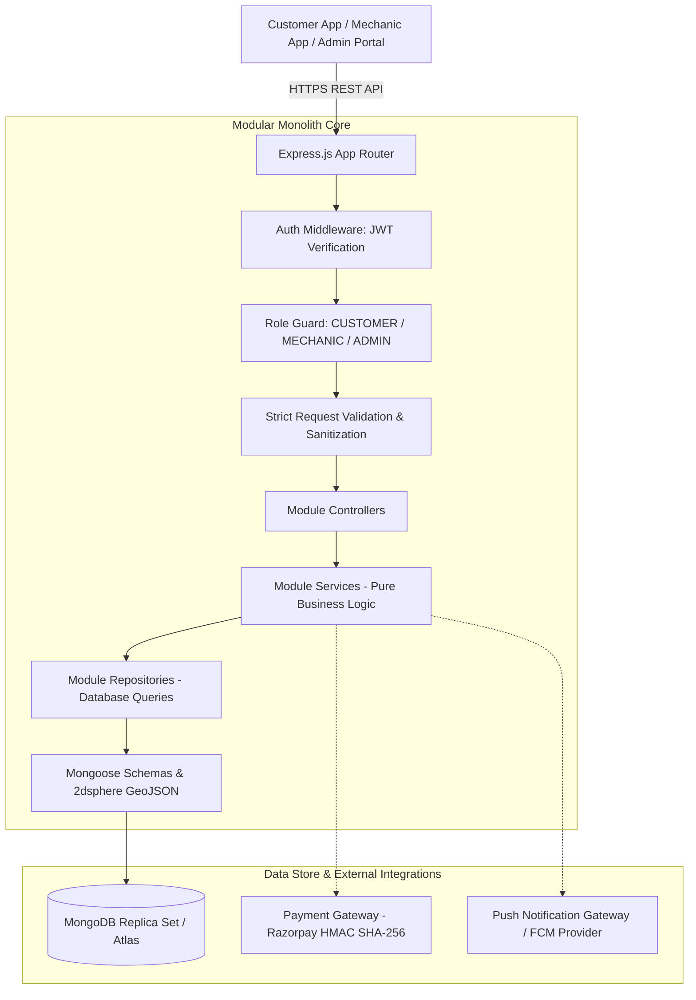
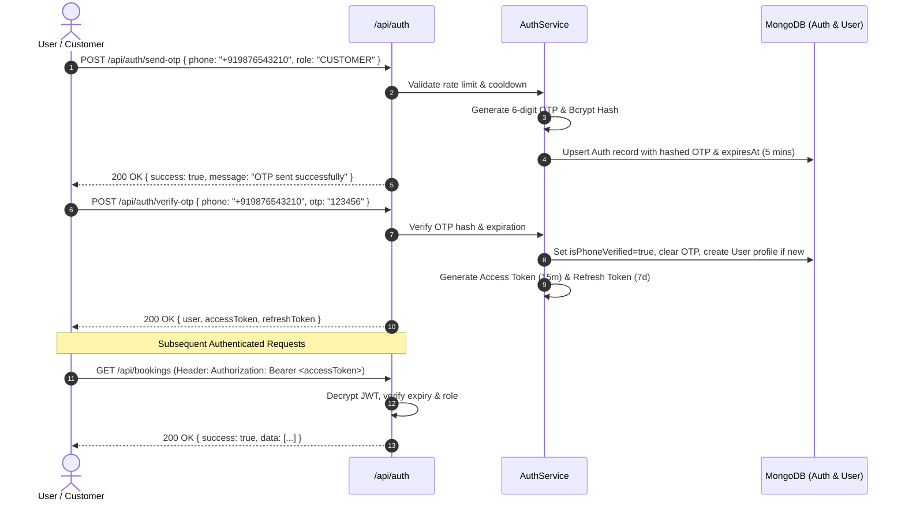
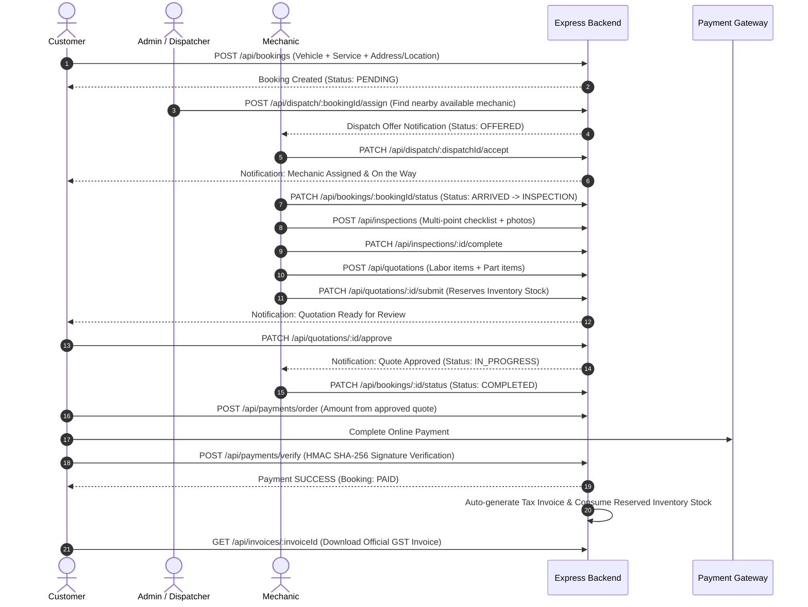

# 🚗 Vehicle Servicing & Roadside Assistance Backend API

A high-performance, modular-monolith backend engineered in **Node.js**, **Express.js**, **MongoDB**, and **Mongoose**. Designed for vehicle servicing management, real-time roadside assistance, dynamic mechanic dispatch, vehicle inspection workflows, dynamic quotation generation, inventory control, secure payment verification, electronic invoicing, and automated administrative oversight.

---

## 📑 Table of Contents
1. [Project Overview](#1-project-overview)
2. [Key Features](#2-key-features)
3. [Technology Stack](#3-technology-stack)
4. [Project Architecture & Directory Structure](#4-project-architecture)
5. [Request Lifecycle](#5-request-lifecycle)
6. [Authentication & Authorization Flow](#6-authentication--authorization-flow)
7. [User Roles & Permissions](#7-user-roles)
8. [Module-by-Module Documentation](#8-module-by-module-documentation)
   - [Auth Module](#auth-module)
   - [User Module](#user-module)
   - [Vehicle Module](#vehicle-module)
   - [Address Module](#address-module)
   - [Location Module](#location-module)
   - [Service Catalogue Module](#service-catalogue-module)
   - [Service Package Module](#service-package-module)
   - [Booking Module](#booking-module)
   - [Dispatch Module](#dispatch-module)
   - [Mechanic Module](#mechanic-module)
   - [Inspection Module](#inspection-module)
   - [Quotation Module](#quotation-module)
   - [Parts / Inventory Module](#parts--inventory-module)
   - [Payment Module](#payment-module)
   - [Invoice Module](#invoice-module)
   - [Notification Module](#notification-module)
   - [Admin Module](#admin-module)
   - [Planned / Future Modules](#planned--future-modules)
9. [Complete End-to-End Workflows](#9-complete-end-to-end-workflows)
10. [Environment Configuration](#10-environment-configuration)
11. [Installation & Local Setup](#11-installation--local-setup)
12. [Testing & Verification](#12-testing--verification)
13. [Security & Architectural Guardrails](#13-security--architectural-guardrails)

---

## 1. Project Overview

### Purpose & Problem Solved
Traditional vehicle servicing and emergency roadside assistance suffer from fragmented booking processes, lack of real-time mechanic dispatching, opaque repair estimations, manual stock reconciliation, and delayed invoicing. 

This platform unifies the entire automotive service lifecycle into a single, cohesive modular monolith:
- **Customers** effortlessly book scheduled maintenance or emergency breakdown recovery, monitor live GPS coordinates, review digital vehicle inspection reports, approve/reject transparent quotations, pay digitally via payment gateways, and download instant GST-compliant tax invoices.
- **Mechanics** receive dispatch requests based on proximity and vehicle compatibility, perform standardized digital inspections, build itemized quotations from central parts inventory, update live GPS location, and manage job progress.
- **Administrators & Dispatchers** operate a centralized dashboard with real-time fleet analytics, manual/auto mechanic dispatching, automated stock reservation, revenue reporting, user account moderation, and immutable audit logs.

### Architecture Overview



---

## 2. Key Features

- **Passwordless Phone/OTP Authentication**: Secure OTP lifecycle management with rate limiting, expiry windows, resend cooldowns, bcrypt hashing, and tamper-proof JWT access/refresh token rotation.
- **Modular Monolith Design**: 17 decoupled modules adhering to the **Routes → Middleware → Controller → Service → Repository → Model** architectural pattern.
- **Geospatial Proximity & Haversine Math**: MongoDB `2dsphere` GeoJSON `Point` indexing (`[longitude, latitude]`) paired with mathematical Haversine algorithms for proximity searches and straight-line distance calculations.
- **Point-in-Time State Snapshots**: Bookings preserve immutable address, vehicle, service, and location snapshots so historical data is protected from subsequent profile updates.
- **Automated Two-Phase Dispatching**: Nearest-mechanic matching respecting service radius, vehicle type capability, verification status, availability status, and idle work status.
- **Structured Digital Inspection**: Standardized checklist with condition ratings (`GOOD`, `FAIR`, `POOR`, `CRITICAL`), estimated repair severity, and image attachments.
- **Transparent Quotation Workflow**: Dynamic calculation of labor charges, parts line items, tiered discounts, and GST tax calculations with formal customer approval/rejection gating.
- **Atomic Two-Phase Inventory Control**: Part stock reservations (`reservedQuantity`) during quotation creation, released upon rejection, and atomically consumed upon invoice generation.
- **Secure Payment Verification**: Order generation, HMAC SHA-256 cryptographic signature validation, idempotent settlement, and webhook listeners without leaking gateway secrets.
- **Electronic Tax Invoicing**: Auto-generated sequential invoice numbers (`INV-YYYYMMDD-XXXX`), line-item tax breakdowns, payment status synchronization, and administrative cancellation.
- **Multi-Channel Push Notifications**: In-app notification store combined with multi-device FCM token registry and failure isolation.
- **Comprehensive Administration & Audit Trails**: Platform-wide metrics, daily booking analytics, revenue aggregation, user moderation, and immutable administrative audit logs (`AdminAuditLog`).

---

## 3. Technology Stack

| Technology | Version | Purpose |
|---|---|---|
| **Node.js** | `>= 18.x` | High-performance JavaScript runtime |
| **Express.js** | `^4.21.2` | RESTful API web framework and HTTP routing |
| **MongoDB** | `>= 6.x / 7.x` | Distributed NoSQL database supporting GeoJSON and compound indexes |
| **Mongoose** | `^8.9.5` | Object Data Modeling (ODM) library for MongoDB |
| **jsonwebtoken** | `^9.0.2` | Cryptographic JWT access and refresh token management |
| **bcryptjs** | `^2.4.3` | Secure salt generation and hashing for OTP storage |
| **cors** | `^2.8.5` | Cross-Origin Resource Sharing middleware |
| **dotenv** | `^16.4.7` | Environment variable configuration manager |

---

## 4. Project Architecture

### Directory Structure

```text
backend/
├── src/
│   ├── app.js                          # Express application setup, global middleware, route mounts, 404 & error handlers
│   ├── server.js                       # Server entry point, database connection bootstrap, graceful shutdown
│   ├── config/
│   │   ├── database.js                 # Mongoose connection manager
│   │   └── env.js                      # Environment configuration parser & schema validator
│   ├── middleware/
│   │   └── auth.middleware.js          # JWT authentication and role-based authorization guards
│   └── modules/                        # Modular Monolith domain packages
│       ├── address/                    # Saved customer delivery/service addresses
│       ├── admin/                      # Administration panel, metrics, user moderation & audit logs
│       ├── auth/                       # OTP generation, verification, token issuance & refresh
│       ├── booking/                    # Service booking state machine & snapshots
│       ├── dispatch/                   # Mechanic dispatching, auto-assignment & lifecycle
│       ├── inspection/                 # Digital multi-point vehicle inspection
│       ├── invoice/                    # GST tax invoice generation & tracking
│       ├── location/                   # Live GPS updates, history sampling, Haversine & nearby discovery
│       ├── mechanic/                   # Professional mechanic profiles, verification & skills
│       ├── notification/               # In-app notifications & device token registry
│       ├── parts/                      # Spare parts catalog, inventory adjustments & reservation
│       ├── payment/                    # Payment orders, cryptographic verification & webhooks
│       ├── quotation/                  # Line-item repair estimates & customer approval gating
│       ├── service/                    # Standalone service catalogue & pricing
│       ├── service-package/            # Bundled service packages & vehicle compatibility
│       ├── user/                       # User profile management & account status
│       ├── vehicle/                    # Customer vehicle registration & VIN management
│       ├── coupon/                     # [Planned / Future] Discount vouchers & promo campaigns
│       ├── pickup-drop/                # [Planned / Future] Valet vehicle pickup & drop-off tracking
│       ├── review/                     # [Planned / Future] Customer ratings & mechanic reviews
│       ├── subscription/               # [Planned / Future] Annual maintenance contracts (AMC)
│       └── support/                    # [Planned / Future] Customer support ticketing & live chat
├── .env                                # Environment variables (ignored by Git)
├── package.json                        # NPM package configuration and dependencies
└── README.md                           # Comprehensive documentation
```

### Module Responsibilities
Each domain module in `src/modules/<module-name>/` maintains strict architectural boundaries:
- `*.constants.js`: Enums, status definitions, boundary limits, and regex patterns.
- `*.model.js`: Mongoose schema, schema options, transformations (`toJSON`, `toObject`), and database indexes.
- `*.repository.js`: Data access layer executing clean Mongoose queries and database aggregations.
- `*.service.js`: Domain business logic, mathematical calculations, cross-module orchestration, and domain assertions.
- `*.controller.js`: HTTP request parsing, response formatting, status codes, and error delegation.
- `*.validation.js`: Express middleware validating input boundaries, formats, types, and rejecting forbidden injected fields.
- `*.routes.js`: Route definitions binding authentication, authorization guards, validation middleware, and controller methods.
- `*.test.js`: Automated unit, integration, and security test suite for the module.

---

## 5. Request Lifecycle

```text
HTTP Request (Client)
  ↓
[1] Express App (src/app.js)
  ↓ (cors, json, urlencoded)
[2] Module Router (src/modules/<domain>/<domain>.routes.js)
  ↓
[3] Authentication Middleware (authenticate - verifies Bearer JWT)
  ↓
[4] Authorization Middleware (authorize - verifies user role: CUSTOMER / MECHANIC / ADMIN)
  ↓
[5] Validation Middleware (validates body/query/params; rejects forbidden fields)
  ↓
[6] Controller Layer (extracts req.user, params, payload; delegates to service)
  ↓
[7] Service Layer (enforces domain rules, invariants, math, cross-module calls)
  ↓
[8] Repository Layer (executes optimized MongoDB queries, projections, indexes)
  ↓
[9] MongoDB Database
  ↓
[10] Repository Layer (returns lean Mongoose objects)
  ↓
[11] Service Layer (formats response DTO, removes internal/sensitive data)
  ↓
[12] Controller Layer (returns standardized JSON HTTP response)
  ↓
HTTP Response 200/201 (Client)
```

---

## 6. Authentication & Authorization Flow



---

## 7. User Roles

| Role | Access Level | Description & Core Responsibilities |
|---|---|---|
| `CUSTOMER` | Customer Context | Manages profile, adds vehicles, saves addresses, updates live location, books services, views assigned mechanics, approves/rejects quotations, initiates payments, downloads invoices, and manages notifications. |
| `MECHANIC` | Service Professional | Manages profile, toggles availability (`AVAILABLE`, `OFFLINE`), updates work status (`IDLE`, `EN_ROUTE`, `ON_JOB`), updates live GPS coordinates, accepts/rejects dispatch assignments, creates digital inspections, and submits repair quotations. |
| `ADMIN` | Platform Administrator | Global oversight across all users, mechanics, services, packages, bookings, dispatch reassignments, inventory stock adjustments, payment reconciliations, invoice cancellations, and system audit logs. |

---

## 8. Module-by-Module Documentation

```
================================================================================
                                1. AUTH MODULE
================================================================================
```

### Purpose
Manages passwordless phone-based OTP authentication, session lifecycle, token generation, and role identification.

### Responsibilities
- 6-digit cryptographic OTP generation and bcrypt hashing.
- Resend rate-limiting (60s cooldown, max 5 requests per 10-minute sliding window).
- JWT Access Token (15m) and Refresh Token (7d) issuance and validation.
- Secure logout and token rotation.

### Database Models
- **`Auth`** (`src/modules/auth/auth.model.js`):
  - `userId`: `ObjectId` (ref: `User`, unique, indexed)
  - `phone`: `String` (E.164 format, unique, indexed)
  - `email`: `String` (optional, unique, sparse indexed)
  - `role`: `String` (`CUSTOMER`, `MECHANIC`, `ADMIN`)
  - `accountStatus`: `String` (`ACTIVE`, `DEACTIVATED`, `BLOCKED`, `SUSPENDED`)
  - `otp`: `{ hash: String, expiresAt: Date, attempts: Number, lastSentAt: Date, sendCount: Number, windowStart: Date }`
  - `refreshToken`: `{ token: String, expiresAt: Date }`
  - `isPhoneVerified`: `Boolean`

### API Endpoints

| Method | Endpoint | Auth | Role | Description |
|---|---|---|---|---|
| `POST` | `/api/auth/send-otp` | No | Public | Generates and sends OTP to phone number |
| `POST` | `/api/auth/verify-otp` | No | Public | Verifies OTP and issues access/refresh tokens |
| `POST` | `/api/auth/refresh-token` | No | Public | Issues new access token from valid refresh token |
| `POST` | `/api/auth/logout` | Yes | All | Invalidates active refresh token |
| `GET` | `/api/auth/me` | Yes | All | Retrieves authenticated user identity |

#### Endpoint Details
- **`POST /api/auth/send-otp`**:
  - Request: `{ "phone": "+919876543210", "role": "CUSTOMER" }`
  - Response: `200 OK` `{ "success": true, "message": "OTP sent successfully" }`
- **`POST /api/auth/verify-otp`**:
  - Request: `{ "phone": "+919876543210", "otp": "123456" }`
  - Response: `200 OK` `{ "success": true, "data": { "user": { "userId", "phone", "role" }, "accessToken", "refreshToken" } }`

---

```
================================================================================
                                2. USER MODULE
================================================================================
```

### Purpose
Maintains customer profile data, personal preferences, and self-service account deactivation.

### Database Models
- **`User`** (`src/modules/user/user.model.js`):
  - `userId`: `ObjectId` (unique, indexed)
  - `firstName`: `String`
  - `lastName`: `String`
  - `email`: `String` (trimmed, lowercase)
  - `gender`: `String` (`MALE`, `FEMALE`, `OTHER`)
  - `avatar`: `String` (URL)
  - `accountStatus`: `String` (`ACTIVE`, `DEACTIVATED`, `BLOCKED`)

### API Endpoints

| Method | Endpoint | Auth | Role | Description |
|---|---|---|---|---|
| `GET` | `/api/users/profile` | Yes | `CUSTOMER`, `ADMIN` | Fetches authenticated user profile |
| `PUT` | `/api/users/profile` | Yes | `CUSTOMER`, `ADMIN` | Updates user profile details |
| `PATCH` | `/api/users/deactivate` | Yes | `CUSTOMER` | Safely deactivates user account |

---

```
================================================================================
                               3. VEHICLE MODULE
================================================================================
```

### Purpose
Stores customer vehicle specifications, registration details, VIN numbers, and fuel types.

### Database Models
- **`Vehicle`** (`src/modules/vehicle/vehicle.model.js`):
  - `userId`: `ObjectId` (ref: `User`, indexed)
  - `make`: `String` (e.g., "Hyundai")
  - `model`: `String` (e.g., "Creta")
  - `variant`: `String` (e.g., "SX(O)")
  - `year`: `Number` (1900 - current year + 1)
  - `vehicleType`: `String` (`TWO_WHEELER`, `FOUR_WHEELER`, `COMMERCIAL`)
  - `fuelType`: `String` (`PETROL`, `DIESEL`, `CNG`, `ELECTRIC`, `HYBRID`)
  - `registrationNumber`: `String` (uppercase, unique per user, indexed)
  - `isDefault`: `Boolean`
  - `isDeleted`: `Boolean` (soft-delete flag)

### API Endpoints

| Method | Endpoint | Auth | Role | Description |
|---|---|---|---|---|
| `POST` | `/api/vehicles` | Yes | `CUSTOMER` | Adds a new vehicle to customer garage |
| `GET` | `/api/vehicles` | Yes | `CUSTOMER`, `ADMIN` | Lists all active customer vehicles |
| `GET` | `/api/vehicles/:vehicleId` | Yes | `CUSTOMER`, `ADMIN` | Retrieves specific vehicle by ID |
| `PUT` | `/api/vehicles/:vehicleId` | Yes | `CUSTOMER` | Updates vehicle attributes |
| `DELETE` | `/api/vehicles/:vehicleId` | Yes | `CUSTOMER` | Soft-deletes a vehicle |

---

```
================================================================================
                               4. ADDRESS MODULE
================================================================================
```

### Purpose
Manages saved customer locations (Home, Work, Office, Other) for doorstep servicing.

### Database Models
- **`Address`** (`src/modules/address/address.model.js`):
  - `userId`: `ObjectId` (ref: `User`, indexed)
  - `label`: `String` (`HOME`, `WORK`, `OFFICE`, `OTHER`)
  - `fullName`: `String`
  - `phone`: `String`
  - `addressLine1`: `String`
  - `addressLine2`: `String`
  - `landmark`: `String`
  - `city`: `String`
  - `state`: `String`
  - `country`: `String`
  - `postalCode`: `String`
  - `latitude`: `Number`
  - `longitude`: `Number`
  - `isDefault`: `Boolean`
  - `status`: `String` (`ACTIVE`, `DELETED`)

### API Endpoints

| Method | Endpoint | Auth | Role | Description |
|---|---|---|---|---|
| `POST` | `/api/addresses` | Yes | `CUSTOMER` | Creates a new saved address |
| `GET` | `/api/addresses` | Yes | `CUSTOMER`, `ADMIN` | Lists customer's saved addresses |
| `GET` | `/api/addresses/:addressId` | Yes | `CUSTOMER`, `ADMIN` | Fetches address details |
| `PUT` | `/api/addresses/:addressId` | Yes | `CUSTOMER` | Updates an existing address |
| `DELETE` | `/api/addresses/:addressId` | Yes | `CUSTOMER` | Soft-deletes an address |
| `PATCH` | `/api/addresses/:addressId/default` | Yes | `CUSTOMER` | Marks address as default |

---

```
================================================================================
                               5. LOCATION MODULE
================================================================================
```

### Purpose
Handles live GPS tracking for customers and mechanics, geospatial proximity queries, Haversine distance calculations, and controlled location history sampling.

### Database Models
- **`Location`** (`src/modules/location/location.model.js`):
  - `userId`: `ObjectId` (ref: `User`, indexed)
  - `mechanicId`: `ObjectId` (ref: `Mechanic`, indexed)
  - `latitude`: `Number` (-90 to 90)
  - `longitude`: `Number` (-180 to 180)
  - `location`: `{ type: "Point", coordinates: [longitude, latitude] }` (indexed with `2dsphere`)
  - `accuracy`: `Number` (meters)
  - `heading`: `Number` (0 - 360 degrees)
  - `speed`: `Number` (m/s)
  - `source`: `String` (`GPS`, `NETWORK`, `MANUAL`, `MAP`, `OTHER`)
  - `locationType`: `String` (`CURRENT`, `HISTORY`)
  - `isCurrent`: `Boolean` (indexed)
  - `expiresAt`: `Date` (TTL index for 30-day automatic history cleanup)

### API Endpoints

| Method | Endpoint | Auth | Role | Description |
|---|---|---|---|---|
| `POST` | `/api/locations/current` | Yes | `CUSTOMER`, `ADMIN` | Updates customer's current GPS location |
| `GET` | `/api/locations/current` | Yes | `CUSTOMER`, `ADMIN` | Retrieves customer's current GPS location |
| `GET` | `/api/locations/history` | Yes | `CUSTOMER`, `ADMIN` | Paginated customer location history |
| `DELETE` | `/api/locations/history` | Yes | `CUSTOMER`, `ADMIN` | Clears customer location history |
| `POST` | `/api/locations/mechanic/current` | Yes | `MECHANIC` | Updates mechanic's live GPS coordinates |
| `GET` | `/api/locations/mechanic/current` | Yes | `MECHANIC` | Retrieves mechanic's own live coordinates |
| `GET` | `/api/locations/mechanics/:mechanicId` | Yes | `ADMIN` / Self | Fetches latest location of specific mechanic |
| `GET` | `/api/locations/mechanics/nearby` | Yes | All | Geospatial query for available mechanics within radius |
| `POST` | `/api/locations/distance` | Yes | All | Calculates straight-line Haversine distance |

---

```
================================================================================
                          6. SERVICE CATALOGUE MODULE
================================================================================
```

### Purpose
Maintains individual automotive services, standard labor pricing, estimated durations, and vehicle compatibility.

### Database Models
- **`Service`** (`src/modules/service/service.model.js`):
  - `name`: `String` (e.g., "Engine Oil & Filter Change")
  - `slug`: `String` (unique, indexed)
  - `description`: `String`
  - `category`: `String` (`PERIODIC_MAINTENANCE`, `BRAKES`, `TYRES`, `BATTERY`, `AC_SERVICE`, etc.)
  - `applicableVehicleTypes`: `[String]` (`TWO_WHEELER`, `FOUR_WHEELER`, `COMMERCIAL`)
  - `basePrice`: `Number`
  - `estimatedDurationMinutes`: `Number`
  - `status`: `String` (`ACTIVE`, `INACTIVE`)

### API Endpoints

| Method | Endpoint | Auth | Role | Description |
|---|---|---|---|---|
| `GET` | `/api/services` | No | Public | Lists active services (filtered by vehicleType/category) |
| `GET` | `/api/services/:serviceId` | No | Public | Fetches service details |
| `POST` | `/api/services` | Yes | `ADMIN` | Creates a new service offering |
| `PUT` | `/api/services/:serviceId` | Yes | `ADMIN` | Updates service pricing and details |
| `PATCH` | `/api/services/:serviceId/status` | Yes | `ADMIN` | Toggles service status (`ACTIVE`/`INACTIVE`) |

---

```
================================================================================
                           7. SERVICE PACKAGE MODULE
================================================================================
```

### Purpose
Provides curated bundles of individual services (e.g., "Comprehensive Full Service", "Roadside Emergency Pack") with bundle discounts.

### Database Models
- **`ServicePackage`** (`src/modules/service-package/servicePackage.model.js`):
  - `name`: `String`
  - `slug`: `String` (unique, indexed)
  - `description`: `String`
  - `packageType`: `String` (`BASIC`, `STANDARD`, `COMPREHENSIVE`, `CUSTOM`)
  - `applicableVehicleTypes`: `[String]`
  - `services`: `[ObjectId]` (refs: `Service`)
  - `originalPrice`: `Number`
  - `discountedPrice`: `Number`
  - `status`: `String` (`ACTIVE`, `INACTIVE`)

### API Endpoints

| Method | Endpoint | Auth | Role | Description |
|---|---|---|---|---|
| `GET` | `/api/service-packages` | No | Public | Lists active bundled service packages |
| `GET` | `/api/service-packages/:packageId` | No | Public | Fetches package details and populated services |
| `POST` | `/api/service-packages` | Yes | `ADMIN` | Creates a new bundled package |
| `PUT` | `/api/service-packages/:packageId` | Yes | `ADMIN` | Updates package components and pricing |
| `PATCH` | `/api/service-packages/:packageId/status`| Yes | `ADMIN` | Toggles package availability status |
| `DELETE` | `/api/service-packages/:packageId` | Yes | `ADMIN` | Soft-deactivates package |

---

```
================================================================================
                               8. BOOKING MODULE
================================================================================
```

### Purpose
Central booking state machine supporting both scheduled maintenance and emergency roadside assistance. Implements point-in-time snapshotting.

### Database Models
- **`Booking`** (`src/modules/booking/booking.model.js`):
  - `bookingReference`: `String` (e.g., `BK-20260926-XXXX`, unique, indexed)
  - `userId`: `ObjectId` (ref: `User`, indexed)
  - `vehicleId`: `ObjectId` (ref: `Vehicle`, indexed)
  - `serviceId`: `ObjectId` (ref: `Service`, optional)
  - `servicePackageId`: `ObjectId` (ref: `ServicePackage`, optional)
  - `bookingType`: `String` (`SCHEDULED`, `EMERGENCY_ROADSIDE`, `DOORSTEP_SERVICE`)
  - `status`: `String` (`PENDING`, `ASSIGNED`, `ACCEPTED`, `ON_THE_WAY`, `ARRIVED`, `INSPECTION`, `QUOTE_PENDING`, `QUOTE_APPROVED`, `IN_PROGRESS`, `COMPLETED`, `PAID`, `CLOSED`, `CANCELLED`)
  - `addressSnapshot`: `{ fullName, phone, addressLine1, city, postalCode }`
  - `locationSnapshot`: `{ latitude, longitude, addressText }`
  - `vehicleSnapshot`: `{ make, model, variant, registrationNumber, vehicleType, fuelType }`
  - `serviceSnapshot`: `{ name, category, basePrice }`
  - `packageSnapshot`: `{ name, discountedPrice, services: [] }`
  - `scheduledAt`: `Date`
  - `cancellationReason`: `String`

### API Endpoints

| Method | Endpoint | Auth | Role | Description |
|---|---|---|---|---|
| `POST` | `/api/bookings` | Yes | `CUSTOMER` | Creates a new service/roadside booking |
| `GET` | `/api/bookings` | Yes | `CUSTOMER`, `ADMIN` | Lists customer's bookings with status filters |
| `GET` | `/api/bookings/:bookingId` | Yes | `CUSTOMER`, `ADMIN` | Fetches booking details and snapshots |
| `PATCH` | `/api/bookings/:bookingId/cancel` | Yes | `CUSTOMER`, `ADMIN` | Cancels an unfulfilled booking |
| `PATCH` | `/api/bookings/:bookingId/status` | Yes | `MECHANIC`, `ADMIN` | Transitions booking status along state machine |

---

```
================================================================================
                              9. DISPATCH MODULE
================================================================================
```

### Purpose
Orchestrates mechanic assignment, automated candidate discovery, job offer timeouts, acceptance/rejection handshakes, and re-dispatch flows.

### Database Models
- **`Dispatch`** (`src/modules/dispatch/dispatch.model.js`):
  - `dispatchReference`: `String` (`DSP-YYYYMMDD-XXXX`, unique, indexed)
  - `bookingId`: `ObjectId` (ref: `Booking`, unique, indexed)
  - `mechanicId`: `ObjectId` (ref: `Mechanic`, indexed)
  - `dispatchType`: `String` (`AUTO`, `MANUAL`, `BROADCAST`)
  - `status`: `String` (`PENDING`, `OFFERED`, `ACCEPTED`, `REJECTED`, `REASSIGNED`, `CANCELLED`, `EXPIRED`, `COMPLETED`)
  - `offeredAt`: `Date`
  - `responseDeadline`: `Date`
  - `acceptedAt`: `Date`
  - `rejectedAt`: `Date`
  - `rejectionReason`: `String`
  - `retryCount`: `Number`

### API Endpoints

| Method | Endpoint | Auth | Role | Description |
|---|---|---|---|---|
| `GET` | `/api/dispatch` | Yes | `ADMIN` | Lists dispatch records with filters |
| `GET` | `/api/dispatch/:dispatchId` | Yes | `MECHANIC`, `ADMIN` | Fetches dispatch assignment details |
| `POST` | `/api/dispatch/:bookingId/assign` | Yes | `ADMIN` | Manually or automatically dispatches booking to mechanic |
| `PATCH` | `/api/dispatch/:dispatchId/accept` | Yes | `MECHANIC` | Assigned mechanic accepts the job offer |
| `PATCH` | `/api/dispatch/:dispatchId/reject` | Yes | `MECHANIC` | Assigned mechanic declines the job offer |
| `PATCH` | `/api/dispatch/:dispatchId/reassign` | Yes | `ADMIN` | Reassigns job to another eligible mechanic |
| `PATCH` | `/api/dispatch/:dispatchId/cancel` | Yes | `ADMIN` | Cancels active dispatch workflow |

---

```
================================================================================
                              10. MECHANIC MODULE
================================================================================
```

### Purpose
Manages service professional profiles, vehicle type specializations, verification approvals, live availability toggling, and rating summaries.

### Database Models
- **`Mechanic`** (`src/modules/mechanic/mechanic.model.js`):
  - `userId`: `ObjectId` (ref: `User`, unique, indexed)
  - `mechanicCode`: `String` (`MECH-YYYYMMDD-XXXX`, unique, indexed)
  - `displayName`: `String`
  - `phone`: `String`
  - `experienceYears`: `Number`
  - `specialization`: `String` (`GENERAL_SERVICE`, `ENGINE_TRANSMISSION`, `ELECTRICAL_BATTERY`, `BODYWORK_DENTING`, `BRAKES_SUSPENSION`, `ROADSIDE_EMERGENCY`)
  - `supportedVehicleTypes`: `[String]`
  - `supportedServiceIds`: `[ObjectId]` (refs: `Service`)
  - `availabilityStatus`: `String` (`AVAILABLE`, `OFFLINE`, `BREAK`)
  - `workStatus`: `String` (`IDLE`, `ASSIGNED`, `EN_ROUTE`, `ON_JOB`)
  - `verificationStatus`: `String` (`PENDING`, `VERIFIED`, `REJECTED`, `SUSPENDED`)
  - `currentLocation`: `{ latitude: Number, longitude: Number, updatedAt: Date }`
  - `serviceRadius`: `Number` (km, default: 15)
  - `ratingSummary`: `{ averageRating: Number, totalRatings: Number }`
  - `completedJobs`: `Number`

### API Endpoints

| Method | Endpoint | Auth | Role | Description |
|---|---|---|---|---|
| `POST` | `/api/mechanics` | Yes | `ADMIN` | Creates a new mechanic profile |
| `GET` | `/api/mechanics` | Yes | `CUSTOMER`, `ADMIN` | Lists verified and available mechanics |
| `GET` | `/api/mechanics/profile/me` | Yes | `MECHANIC` | Fetches authenticated mechanic's self profile |
| `GET` | `/api/mechanics/:mechanicId` | Yes | `CUSTOMER`, `ADMIN` | Fetches mechanic details |
| `PUT` | `/api/mechanics/profile/me` | Yes | `MECHANIC` | Updates mechanic profile and specializations |
| `PATCH` | `/api/mechanics/:mechanicId/availability` | Yes | `MECHANIC`, `ADMIN` | Updates availability (`AVAILABLE`/`OFFLINE`) |
| `PATCH` | `/api/mechanics/:mechanicId/work-status` | Yes | `MECHANIC`, `ADMIN` | Updates work status (`IDLE`/`ON_JOB`) |
| `PATCH` | `/api/mechanics/:mechanicId/location` | Yes | `MECHANIC`, `ADMIN` | Direct coordinate update on mechanic profile |
| `PATCH` | `/api/mechanics/:mechanicId/verification` | Yes | `ADMIN` | Admin approves/rejects mechanic verification |

---

```
================================================================================
                             11. INSPECTION MODULE
================================================================================
```

### Purpose
Enables assigned mechanics to perform comprehensive digital multi-point inspections on customer vehicles upon arrival.

### Database Models
- **`Inspection`** (`src/modules/inspection/inspection.model.js`):
  - `inspectionReference`: `String` (`INSP-YYYYMMDD-XXXX`, unique, indexed)
  - `bookingId`: `ObjectId` (ref: `Booking`, unique, indexed)
  - `mechanicId`: `ObjectId` (ref: `Mechanic`, indexed)
  - `status`: `String` (`DRAFT`, `IN_PROGRESS`, `COMPLETED`, `CANCELLED`)
  - `odometerReading`: `Number`
  - `fuelLevelPercent`: `Number` (0 - 100)
  - `findings`: `[{ systemCategory, componentName, condition: 'GOOD'|'FAIR'|'POOR'|'CRITICAL', severity: 'NONE'|'LOW'|'MEDIUM'|'HIGH', remarks, images: [] }]`
  - `generalRemarks`: `String`
  - `completedAt`: `Date`

### API Endpoints

| Method | Endpoint | Auth | Role | Description |
|---|---|---|---|---|
| `POST` | `/api/inspections` | Yes | `MECHANIC` | Starts an inspection for an active booking |
| `GET` | `/api/inspections` | Yes | `CUSTOMER`, `ADMIN` | Lists inspection records |
| `GET` | `/api/inspections/:inspectionId` | Yes | All | Retrieves inspection details and findings |
| `GET` | `/api/inspections/booking/:bookingId`| Yes | All | Fetches inspection linked to booking |
| `PUT` | `/api/inspections/:inspectionId` | Yes | `MECHANIC` | Updates inspection findings draft |
| `PATCH` | `/api/inspections/:inspectionId/complete`| Yes | `MECHANIC` | Finalizes inspection, unlocking quotation flow |

---

```
================================================================================
                              12. QUOTATION MODULE
================================================================================
```

### Purpose
Calculates detailed cost estimates comprising labor charges and spare parts. Integrates with customer approval workflows and inventory stock reservation.

### Database Models
- **`Quotation`** (`src/modules/quotation/quotation.model.js`):
  - `quotationReference`: `String` (`QT-YYYYMMDD-XXXX`, unique, indexed)
  - `bookingId`: `ObjectId` (ref: `Booking`, indexed)
  - `inspectionId`: `ObjectId` (ref: `Inspection`, indexed)
  - `mechanicId`: `ObjectId` (ref: `Mechanic`, indexed)
  - `userId`: `ObjectId` (ref: `User`, indexed)
  - `laborItems`: `[{ description, estimatedHours, hourlyRate, amount }]`
  - `partItems`: `[{ partId, partName, partSku, unitPrice, quantity, total }]`
  - `subtotal`: `Number`
  - `discount`: `Number`
  - `taxRatePercent`: `Number` (default: 18% GST)
  - `taxAmount`: `Number`
  - `totalAmount`: `Number`
  - `status`: `String` (`DRAFT`, `PENDING_APPROVAL`, `APPROVED`, `REJECTED`, `EXPIRED`)
  - `rejectionReason`: `String`
  - `validUntil`: `Date`

### API Endpoints

| Method | Endpoint | Auth | Role | Description |
|---|---|---|---|---|
| `POST` | `/api/quotations` | Yes | `MECHANIC` | Creates quotation draft from completed inspection |
| `GET` | `/api/quotations` | Yes | `CUSTOMER`, `ADMIN` | Lists quotations with filters |
| `GET` | `/api/quotations/:quotationId` | Yes | All | Fetches itemized quotation breakdown |
| `GET` | `/api/quotations/booking/:bookingId` | Yes | All | Fetches quotation for a specific booking |
| `PUT` | `/api/quotations/:quotationId` | Yes | `MECHANIC` | Edits quotation items while in draft |
| `PATCH` | `/api/quotations/:quotationId/submit` | Yes | `MECHANIC` | Submits quotation for customer approval; reserves parts |
| `PATCH` | `/api/quotations/:quotationId/approve` | Yes | `CUSTOMER` | Customer approves quotation; transitions booking |
| `PATCH` | `/api/quotations/:quotationId/reject` | Yes | `CUSTOMER` | Customer rejects quotation; releases reserved parts |

---

```
================================================================================
                         13. PARTS / INVENTORY MODULE
================================================================================
```

### Purpose
Maintains automotive parts catalog, tracks physical and reserved stock quantities, handles vehicle compatibility, and records stock adjustments.

### Database Models
- **`Part`** (`src/modules/parts/parts.model.js`):
  - `name`: `String`
  - `sku`: `String` (unique, uppercase, indexed)
  - `partNumber`: `String`
  - `category`: `String` (`ENGINE`, `BRAKES`, `SUSPENSION`, `ELECTRICAL`, `BODY`, `FILTERS`, `OILS_LUBRICANTS`, `TYRES_WHEELS`, `ACCESSORIES`)
  - `compatibleVehicles`: `[{ vehicleType, make, model, yearFrom, yearTo }]`
  - `costPrice`: `Number` (Admin view only)
  - `sellingPrice`: `Number`
  - `stockQuantity`: `Number` (physical on-hand inventory)
  - `reservedQuantity`: `Number` (units allocated to pending/approved quotations)
  - `lowStockThreshold`: `Number`
  - `status`: `String` (`ACTIVE`, `INACTIVE`, `DISCONTINUED`)
- **Virtual Properties**:
  - `availableQuantity`: `stockQuantity - reservedQuantity`
  - `isLowStock`: `availableQuantity <= lowStockThreshold`

### API Endpoints

| Method | Endpoint | Auth | Role | Description |
|---|---|---|---|---|
| `GET` | `/api/parts` | Yes | All | Lists parts (filtered by vehicle compatibility) |
| `GET` | `/api/parts/:partId` | Yes | All | Fetches part specifications and stock availability |
| `POST` | `/api/parts` | Yes | `ADMIN` | Creates a new part SKU in inventory |
| `PUT` | `/api/parts/:partId` | Yes | `ADMIN` | Updates part metadata and selling price |
| `PATCH` | `/api/parts/:partId/stock` | Yes | `ADMIN` | Adjusts physical stock (`ADD`, `REMOVE`, `SET`) |
| `PATCH` | `/api/parts/:partId/status` | Yes | `ADMIN` | Toggles part availability status |

---

```
================================================================================
                              14. PAYMENT MODULE
================================================================================
```

### Purpose
Manages payment orders, cryptographic verification of payment gateway signatures (Razorpay HMAC SHA-256), webhook processing, and settlement tracking.

### Database Models
- **`Payment`** (`src/modules/payment/payment.model.js`):
  - `paymentReference`: `String` (`PAY-YYYYMMDD-XXXX`, unique, indexed)
  - `bookingId`: `ObjectId` (ref: `Booking`, indexed)
  - `quotationId`: `ObjectId` (ref: `Quotation`, indexed)
  - `userId`: `ObjectId` (ref: `User`, indexed)
  - `amount`: `Number`
  - `currency`: `String` (default: `INR`)
  - `gatewayProvider`: `String` (`RAZORPAY`, `STRIPE`, `CASH`, `UPI`, `MANUAL`)
  - `gatewayOrderId`: `String` (indexed)
  - `gatewayPaymentId`: `String` (indexed)
  - `status`: `String` (`CREATED`, `PENDING`, `SUCCESS`, `FAILED`, `REFUNDED`, `CANCELLED`)
  - `paymentMethod`: `String` (`CARD`, `UPI`, `NETBANKING`, `WALLET`, `CASH`)
  - `paidAt`: `Date`
  - `gatewayResponse`: `Object`

### API Endpoints

| Method | Endpoint | Auth | Role | Description |
|---|---|---|---|---|
| `POST` | `/api/payments/order` | Yes | `CUSTOMER` | Initializes payment gateway order for approved quotation |
| `POST` | `/api/payments/verify` | Yes | `CUSTOMER` | Cryptographically verifies HMAC signature and settles payment |
| `POST` | `/api/payments/webhook` | No | Public (Webhook) | Server-to-server gateway webhook processor |
| `GET` | `/api/payments` | Yes | `CUSTOMER`, `ADMIN` | Lists customer payment history |
| `GET` | `/api/payments/:paymentId` | Yes | `CUSTOMER`, `ADMIN` | Fetches payment receipt details |
| `GET` | `/api/payments/booking/:bookingId` | Yes | `CUSTOMER`, `ADMIN` | Fetches payment linked to a booking |

---

```
================================================================================
                              15. INVOICE MODULE
================================================================================
```

### Purpose
Generates GST-compliant electronic invoices upon successful job completion and payment settlement. Handles inventory stock consumption.

### Database Models
- **`Invoice`** (`src/modules/invoice/invoice.model.js`):
  - `invoiceNumber`: `String` (`INV-YYYYMMDD-XXXX`, unique, indexed)
  - `bookingId`: `ObjectId` (ref: `Booking`, indexed)
  - `paymentId`: `ObjectId` (ref: `Payment`, indexed)
  - `quotationId`: `ObjectId` (ref: `Quotation`, indexed)
  - `userId`: `ObjectId` (ref: `User`, indexed)
  - `customerSnapshot`: `{ name, phone, email, address }`
  - `vehicleSnapshot`: `{ make, model, registrationNumber }`
  - `lineItems`: `[{ itemType: 'LABOR'|'PART', description, quantity, unitPrice, total }]`
  - `subtotal`: `Number`
  - `discount`: `Number`
  - `taxRatePercent`: `Number`
  - `taxAmount`: `Number`
  - `totalAmount`: `Number`
  - `invoiceStatus`: `String` (`DRAFT`, `ISSUED`, `PAID`, `CANCELLED`)
  - `issuedAt`: `Date`

### API Endpoints

| Method | Endpoint | Auth | Role | Description |
|---|---|---|---|---|
| `POST` | `/api/invoices/generate` | Yes | `CUSTOMER`, `ADMIN` | Generates official tax invoice after payment settlement |
| `GET` | `/api/invoices` | Yes | `CUSTOMER`, `ADMIN` | Lists customer tax invoices |
| `GET` | `/api/invoices/:invoiceId` | Yes | `CUSTOMER`, `ADMIN` | Fetches invoice breakdown by ID |
| `GET` | `/api/invoices/booking/:bookingId` | Yes | `CUSTOMER`, `ADMIN` | Fetches invoice linked to booking |
| `GET` | `/api/invoices/number/:invoiceNumber`| Yes | `CUSTOMER`, `ADMIN` | Fetches invoice by invoice number |
| `PATCH` | `/api/invoices/:invoiceId/cancel` | Yes | `ADMIN` | Cancels invoice and records reason |

---

```
================================================================================
                            16. NOTIFICATION MODULE
================================================================================
```

### Purpose
Manages in-app notifications and customer/mechanic FCM push notification device token registries.

### Database Models
- **`Notification`** (`src/modules/notification/notification.model.js`):
  - `userId`: `ObjectId` (ref: `User`, indexed)
  - `title`: `String`
  - `body`: `String`
  - `category`: `String` (`BOOKING`, `DISPATCH`, `INSPECTION`, `QUOTATION`, `PAYMENT`, `INVOICE`, `SYSTEM`)
  - `priority`: `String` (`LOW`, `NORMAL`, `HIGH`, `URGENT`)
  - `entityType`: `String`
  - `entityId`: `ObjectId`
  - `isRead`: `Boolean`
  - `readAt`: `Date`
- **`DeviceToken`** (`src/modules/notification/deviceToken.model.js`):
  - `userId`: `ObjectId` (ref: `User`, indexed)
  - `deviceToken`: `String` (FCM push token, unique, indexed)
  - `platform`: `String` (`ANDROID`, `IOS`, `WEB`)
  - `isActive`: `Boolean`

### API Endpoints

| Method | Endpoint | Auth | Role | Description |
|---|---|---|---|---|
| `POST` | `/api/notifications/devices` | Yes | All | Registers/updates FCM device token |
| `DELETE` | `/api/notifications/devices/:deviceId` | Yes | All | Deregisters FCM device token |
| `GET` | `/api/notifications` | Yes | All | Lists paginated in-app notifications |
| `GET` | `/api/notifications/unread-count` | Yes | All | Gets total count of unread notifications |
| `GET` | `/api/notifications/:notificationId` | Yes | All | Retrieves specific notification details |
| `PATCH` | `/api/notifications/:notificationId/read` | Yes | All | Marks notification as read |
| `PATCH` | `/api/notifications/read-all` | Yes | All | Marks all user notifications as read |
| `DELETE` | `/api/notifications/:notificationId` | Yes | All | Soft-deletes a notification |

---

```
================================================================================
                               17. ADMIN MODULE
================================================================================
```

### Purpose
Administrative orchestration layer providing platform telemetry, revenue analytics, user moderation, mechanic verification, global search, and immutable audit logs.

### Database Models
- **`Admin`** (`src/modules/admin/admin.model.js`):
  - `userId`: `ObjectId` (ref: `User`, unique, indexed)
  - `adminCode`: `String` (`ADM-YYYYMMDD-XXXX`, unique, indexed)
  - `displayName`: `String`
  - `department`: `String`
  - `permissions`: `[String]`
  - `status`: `String` (`ACTIVE`, `INACTIVE`, `SUSPENDED`)
- **`AdminAuditLog`** (`src/modules/admin/admin-audit-log.model.js`):
  - `adminId`: `ObjectId` (ref: `User`, indexed)
  - `action`: `String` (`UPDATE_USER_STATUS`, `VERIFY_MECHANIC`, `CANCEL_BOOKING`, etc.)
  - `module`: `String` (`USER`, `MECHANIC`, `BOOKING`, `PAYMENT`, `ADMIN`, etc.)
  - `entityType`: `String`
  - `entityId`: `String`
  - `description`: `String`
  - `metadata`: `Object`
  - `ipAddress`: `String`
  - `userAgent`: `String`
  - `createdAt`: `Date` (indexed)

### API Endpoints

| Method | Endpoint | Auth | Role | Description |
|---|---|---|---|---|
| `GET` | `/api/admin/profile` | Yes | `ADMIN` | Fetches authenticated admin profile |
| `PUT` | `/api/admin/profile` | Yes | `ADMIN` | Updates admin profile metadata |
| `GET` | `/api/admin/dashboard` | Yes | `ADMIN` | High-level platform counts across all entities |
| `GET` | `/api/admin/dashboard/bookings` | Yes | `ADMIN` | Daily booking trend aggregation |
| `GET` | `/api/admin/dashboard/revenue` | Yes | `ADMIN` | Revenue statistics calculated from `SUCCESS` payments |
| `GET` | `/api/admin/dashboard/mechanics` | Yes | `ADMIN` | Fleet availability, work status & verification stats |
| `GET` | `/api/admin/search` | Yes | `ADMIN` | Multi-collection search across users, bookings, mechanics |
| `GET` | `/api/admin/users` | Yes | `ADMIN` | Paginated user list with status & search filters |
| `GET` | `/api/admin/users/:userId` | Yes | `ADMIN` | Full user profile with linked vehicles & booking counts |
| `PATCH` | `/api/admin/users/:userId/status` | Yes | `ADMIN` | Moderates user account status (`ACTIVE`, `BLOCKED`, `SUSPENDED`) |
| `GET` | `/api/admin/mechanics` | Yes | `ADMIN` | Lists mechanics with verification filters |
| `GET` | `/api/admin/mechanics/:mechanicId` | Yes | `ADMIN` | Fetches mechanic details |
| `PATCH` | `/api/admin/mechanics/:mechanicId/verification` | Yes | `ADMIN` | Verifies/rejects mechanic profiles |
| `GET` | `/api/admin/bookings` | Yes | `ADMIN` | Paginated booking list with multidimensional filters |
| `GET` | `/api/admin/bookings/:bookingId` | Yes | `ADMIN` | Full booking view with linked inspection, quote, payment |
| `PATCH` | `/api/admin/bookings/:bookingId/cancel` | Yes | `ADMIN` | Administratively cancels a booking with audit trail |
| `GET` | `/api/admin/audit-logs` | Yes | `ADMIN` | Paginated system audit logs |

---

### Planned / Future Modules
The following directories exist in the project scaffolding for upcoming feature releases:
- **`coupon/`** (*Planned / Future*): Promotional coupon code validation, percentage/flat discounts, and usage limits.
- **`pickup-drop/`** (*Planned / Future*): Driver tracking for doorstep vehicle pick-up and return delivery.
- **`review/`** (*Planned / Future*): Post-service ratings, star reviews, and public mechanic feedback.
- **`subscription/`** (*Planned / Future*): Annual maintenance contract (AMC) recurring plans.
- **`support/`** (*Planned / Future*): Helpdesk ticket creation, customer dispute management, and support agent live chat.

---

## 9. Complete End-to-End Workflows

### Comprehensive Service Lifecycle



---

## 10. Environment Configuration

Create a `.env` file in the root directory:

```env
# Application Port and Runtime Mode
PORT=5000
NODE_ENV=development

# MongoDB Connection String (Atlas or Local Instance)
MONGO_URI=mongodb://localhost:27017/vehicle_booking

# JWT Cryptographic Secrets & Token Lifespans
JWT_ACCESS_SECRET=your_super_secret_jwt_access_key_min_32_chars
JWT_REFRESH_SECRET=your_super_secret_jwt_refresh_key_min_32_chars
JWT_ACCESS_EXPIRES_IN=15m
JWT_REFRESH_EXPIRES_IN=7d

# OTP Verification Configuration
OTP_EXPIRY_MINUTES=5
OTP_RESEND_COOLDOWN_SECONDS=60
OTP_MAX_REQUESTS=5
OTP_WINDOW_MINUTES=10

# Optional Payment Gateway Configuration
RAZORPAY_KEY_ID=rzp_test_your_key_id
RAZORPAY_KEY_SECRET=your_razorpay_secret_key
RAZORPAY_WEBHOOK_SECRET=your_webhook_secret_key
```

---

## 11. Installation & Local Setup

### Prerequisites
- [Node.js](https://nodejs.org/) `>= 18.0.0`
- [MongoDB](https://www.mongodb.com/) `>= 6.0` (Running locally or via MongoDB Atlas)
- [Git](https://git-scm.com/)

### Step-by-Step Setup

1. **Clone the repository:**
   ```bash
   git clone https://github.com/Abhishek3775/Vehicle-Booking.git
   cd Vehicle-Booking/backend
   ```

2. **Install dependencies:**
   ```bash
   npm install
   ```

3. **Configure Environment Variables:**
   ```bash
   cp .env.example .env
   # Edit .env with your MongoDB URI and JWT secrets
   ```

4. **Start the Development Server:**
   ```bash
   npm run dev
   ```

5. **Verify API Health:**
   ```bash
   curl http://localhost:5000/health
   ```
   **Expected Response:**
   ```json
   {
     "success": true,
     "message": "Vehicle Booking API server is healthy",
     "data": {
       "uptime": 1.25,
       "timestamp": "2026-09-26T20:20:00.000Z"
     }
   }
   ```

---

## 12. Testing & Verification

Every module includes an automated, isolated test suite verifying validation rules, state machines, role security, and database operations without external side effects.

### Run All Module Test Suites
```bash
# From the backend directory
Get-ChildItem -Path src/modules -Recurse -Filter *.test.js | ForEach-Object { node $_.FullName }
```

### Run Individual Module Tests
```bash
node src/modules/auth/auth.test.js
node src/modules/booking/booking.test.js
node src/modules/location/location.test.js
node src/modules/mechanic/mechanic.test.js
node src/modules/dispatch/dispatch.test.js
node src/modules/inspection/inspection.test.js
node src/modules/quotation/quotation.test.js
node src/modules/parts/parts.test.js
node src/modules/payment/payment.test.js
node src/modules/invoice/invoice.test.js
node src/modules/admin/admin.test.js
```

---

## 13. Security & Architectural Guardrails

1. **Server-Resolved Identity**: The backend **never** trusts `userId`, `mechanicId`, or `adminId` from request bodies or parameters. Identity is strictly derived from verified JWT authentication context (`req.user.userId`).
2. **Client Injection Prevention**: Validation middlewares strip and reject forbidden fields (e.g., `role`, `status`, `accountStatus`, `isCurrent`, `createdAt`, `password`, `isPhoneVerified`).
3. **Cryptographic Gateway Verification**: Payment settlements require HMAC SHA-256 signature verification computed directly from raw order and payment IDs before marking records `SUCCESS`.
4. **Geospatial Coordinate Validation**: Strict numeric boundary enforcement on latitude (`-90` to `90`) and longitude (`-180` to `180`), rejecting `NaN`, `Infinity`, and unparsed strings.
5. **Two-Phase Inventory Lock**: Parts stock is reserved during quotation submission and only consumed upon formal invoice generation, preventing stock overselling.
6. **Data Privacy & Sanitization**: Secrets, API keys, passwords, OTP hashes, cost prices, and cross-customer locations are strictly redacted from client API responses.
7. **Immutable Audit Trails**: High-privilege administrative actions automatically record user ID, action, target entity, timestamp, IP address, and user agent into `AdminAuditLog`.

---

*Engineered with precision for reliability, developer clarity, and seamless scale.*